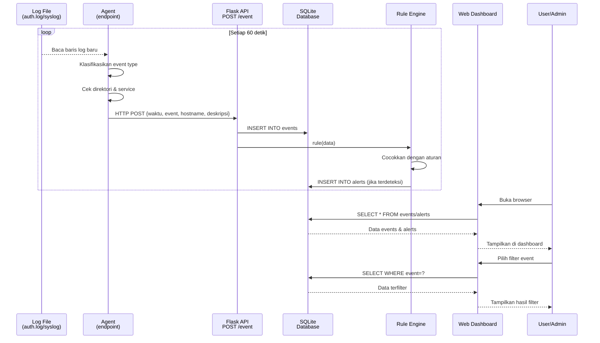

# Diagram Aliran Data

**Aliran Data:**
1. Agent membaca log file di endpoint → mengklasifikasikan event
2. Agent mengirim event ke SIEM server via HTTP POST (JSON)
3. Server menyimpan event ke SQLite
4. Rule Engine menganalisis event dan membuat alert jika perlu
5. Dashboard membaca dari database dan menampilkan ke user
6. Reporting module mengekspor ke CSV, JSON, dan TXT
